<h1 align="center">Hi 👋👨‍💻, I'm Kash </h1>
<h3 align="center">A passionate Computer Science student currently studying at KCG College Of Technology.</h3>

  

  

  

- 🔭 I’m currently working on a project for free notes source for engineers

- 🌱 I’m currently learning **Neural Network**

- 👯 I’m looking to collaborate on **real world projects**

- 💬 Ask me about **Python, MongoDB, MySQL**

- 📫 How to reach me **dharmaprakash144@gmail.com**

<h3 align="left">Connect with me:</h3>

<h3 align="left">Languages and Tools:</h3>

                     

&nbsp;

---

## 🤖 AI/ML Expertise

### Machine Learning Specializations

### Research Areas

## 🚀 Featured AI Projects

### 🚗 Software-Defined Vehicle (SDV) Anomaly Detection
> **Real-time AI system for autonomous vehicle safety**
- **Algorithm**: Isolation Forest for unsupervised anomaly detection
- **Dataset**: Vehicle telemetry data (speed, acceleration, GPS, sensor readings)
- **Impact**: Detects unsafe driving patterns with 94% accuracy
- **Tech Stack**: Python, scikit-learn, Streamlit, pandas, matplotlib
- **Features**: Real-time monitoring, interactive dashboard, alert system

### 🛡️ Smart Farm Protection System (🥈 Hackathon Winner)
> **IoT + AI solution for agricultural threat detection**
- **Hardware**: Arduino, thermal sensors, ultrasonic sensors, Wi-Fi modules
- **AI Component**: Pattern recognition for animal threat classification
- **Achievement**: 2nd Place at Pitch Perfect '24 Hackathon
- **Impact**: Automated detection and response to wildlife threats

### 🐍 Machine Learning Portfolio
> **Comprehensive collection of ML implementations**
- **Algorithms**: Linear/Logistic Regression, Decision Trees, Random Forest, SVM
- **Projects**: Data preprocessing, feature engineering, model optimization
- **Tools**: Jupyter Notebooks, Google Colab, scikit-learn, pandas

## 📊 AI Engineering Skills Matrix

<table align="center">
<tr>
<th>Category</th>
<th>Technologies</th>
<th>Experience Level</th>
</tr>
<tr>
<td><strong>Machine Learning</strong></td>
<td>scikit-learn, pandas, numpy</td>
<td>🟢🟢🟢🟡⚪ Advanced</td>
</tr>
<tr>
<td><strong>Deep Learning</strong></td>
<td>TensorFlow, PyTorch, Keras</td>
<td>🟢🟢🟡⚪⚪ Intermediate</td>
</tr>
<tr>
<td><strong>Data Analysis</strong></td>
<td>pandas, matplotlib, seaborn</td>
<td>🟢🟢🟢🟢⚪ Proficient</td>
</tr>
<tr>
<td><strong>IoT Development</strong></td>
<td>Arduino, Raspberry Pi, Sensors</td>
<td>🟢🟢🟢⚪⚪ Intermediate</td>
</tr>
<tr>
<td><strong>Web Development</strong></td>
<td>Streamlit, HTML/CSS/JS</td>
<td>🟢🟢🟢⚪⚪ Intermediate</td>
</tr>
</table>

## 🎯 Current Learning Path

```mermaid
%%{init: {'theme':'dark'}}%%
graph LR
    A[🧠 Neural Networks] --> B[🔬 Deep Learning]
    B --> C[👁️ Computer Vision]
    C --> D[🤖 Advanced AI Systems]
    D --> E[🚀 AI in Production]
    
    style A fill:#ff6b6b
    style B fill:#4ecdc4
    style C fill:#45b7d1
    style D fill:#96ceb4
    style E fill:#feca57
```

- **Phase 1**: Mastering Neural Network architectures (Current)
- **Phase 2**: Advanced Deep Learning frameworks
- **Phase 3**: Computer Vision and Image Processing
- **Phase 4**: Production-ready AI systems
- **Phase 5**: MLOps and AI deployment strategies

## 🏆 Professional Achievements

| Achievement | Details | Year |
|-------------|---------|------|
| 🥈 **Hackathon Winner** | Pitch Perfect '24 - Animal Threat Detection | 2024 |
| 🐍 **Python Intern** | CodSoft - ML Projects & Algorithms | 2024 |
| 📜 **Certifications** | Python, NPTEL, Git & GitHub | 2024 |
| 🤖 **AI Project Lead** | SDV Anomaly Detection System | 2025 |
| 📚 **Research Focus** | Machine Learning in Autonomous Systems | 2025 |

## 💡 Research Interests

- **🚗 Autonomous Vehicle Safety**: Developing AI systems for real-time anomaly detection in self-driving cars
- **🌱 Smart Agriculture**: IoT + AI solutions for sustainable farming and crop protection
- **🔍 Anomaly Detection**: Unsupervised learning for identifying unusual patterns in complex datasets
- **🌐 Edge AI**: Deploying machine learning models on IoT devices and embedded systems
- **🔄 MLOps**: Best practices for deploying and maintaining AI systems in production

## 📈 Learning & Development

### 2025 Goals
- [ ] Complete Neural Networks specialization
- [ ] Publish research paper on SDV anomaly detection
- [ ] Contribute to open-source ML projects
- [ ] Build production-ready AI applications
- [ ] Expand IoT + AI integration expertise

### Recent Accomplishments
- ✅ Implemented Isolation Forest for SDV anomaly detection
- ✅ Won 2nd place in hackathon with IoT solution
- ✅ Completed Python programming internship
- ✅ Built interactive ML dashboard with Streamlit
- ✅ Integrated hardware sensors with AI algorithms

## 🌟 Let's Collaborate!

**I'm always excited to collaborate on:**
- 🤖 AI/ML research projects
- 🚗 Autonomous vehicle technology
- 🌱 Smart IoT solutions
- 📊 Data science challenges
- 🔬 Open-source contributions

**Looking for opportunities in:**
- Machine Learning Engineering roles
- AI Research internships
- IoT + AI project collaborations
- Hackathons and competitions

---

  
**💡 "Building the future with AI, one algorithm at a time" 💡**

*"Passionate about turning complex problems into intelligent solutions"*

